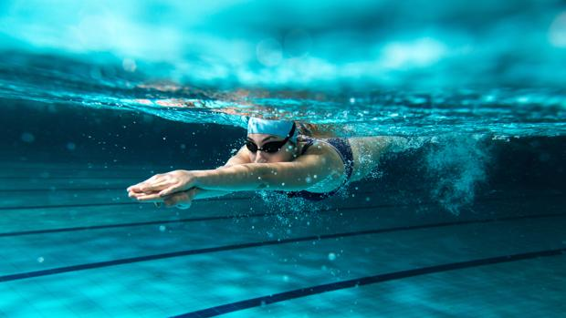

# pagina-de-computacion
deportes 
<html>
<head>

                                                                            <title>Deportes</title>
  
</head>

<body bgcolor="#79f52e" text="red">

 <h1>¿Que son los deportes? </h1>

 
<h1><b>Natacion</b></h1>
 
</face>
<tr>
<td>VENTAJAS</td>
<td>DESVENTAJAS</td>
</tr>
<tr>
<td>
</td>
<td>
</td>
</tr>
</table>

<h3><h3>MOVIMIENTO DE FLECHA</h3>

<h1><b>Basquetbol</b></h1>

</face>
<table border="1">
<tr>
<td>VENTAJAS</td>
<td>DESVENTAJAS</td>
</tr>
<tr>
<td>
</td>
<td>
</tr>
</table>

<h3><h3>MOVIMIENTO DE MANOS</h3>

 
<h1><b>Futbol</b></h1>
 

<table border="1">
<tr>
<td>VENTAJAS</td>
<td>DESVENTAJAS</td>
</tr>
<tr>
<td>

Trabaja sobre la velocidad y la habilidad.

</td>
<td>
</td>
</tr>
</table>

<h3><h3>PASE O REGATE</h3>

 
<h1><b>Golf</b></h1>
 

<table border="1">
<tr>
<td>VENTAJAS</td>
<td>DESVENTAJAS</td>
</tr>
<tr>
<td>
</td>
<td>
</tr>
</table>

<h3><h3>TIRO PERFECTO</h3>

 
<h1><b>Gimnasia</b></h1>
 

<table border="1">
<tr>
<td>VENTAJAS</td>
<td>DESVENTAJAS</td>
</tr>
<tr>
<td>
</td>
<td>
</tr>
</table>

<h3><h3>180 GRADOS</h3>

<h3><h3>DA CLICK A ESTA IMAGEN Y CONOCERAS UN VIDEO ACERCA DEL TEMA</h3>

</body>
</html>
